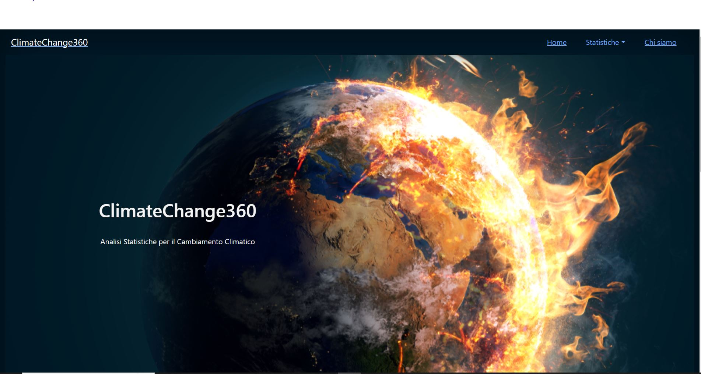

# Climate Change Web App - Home page

Web App on climate change.

> Live demo [_here_](https://climate-change-360.netlify.app/). <!-- If you have the project hosted somewhere, include the link here. -->

##Summary

- [General information](#general-information)
- [Technologies used](#technologies-used)
- [Screenshot](#screenshot)
- [Usage](#usage)
- [Project status](#project-status)
- [Acknowledgments](#acknowledgments)
- [Contact](#contact)
- [License](#license)

## General informations

This site intends to show and raise visitor awareness on the topic of climate change.
It also shows the variations over time of certain parameters that influence climate change.

##Used technologies

- HTML
- Css
- Bootstrap
- Javascript
- React
- React Router
- Chatt js
- Visual Studio Core (publisher)
- GitHub

## Screenshot

Screenshot of the application at its initial value

## Usage

The site is structured very simply:

- Homepage: shows a header and tabs that connect to the individual parameter pages.
- Statistics: A section where the various parameters are shown with graphs.
- Who we are: Describes the site, what it does, tends to raise visitor awareness and links to various useful external links for further information on the topic.

## Project status

The project is completed.

##Thanks

This project is the last of the Start2Impact 'Frontend Developer' course and serves to evaluate all my skills acquired during the course.

##Contact

Created by [Alessandro Aglianò](https://alessandroagliano.github.io/) - don't hesitate to contact me!

## License -->

This project is open source and available under the Mit license.
